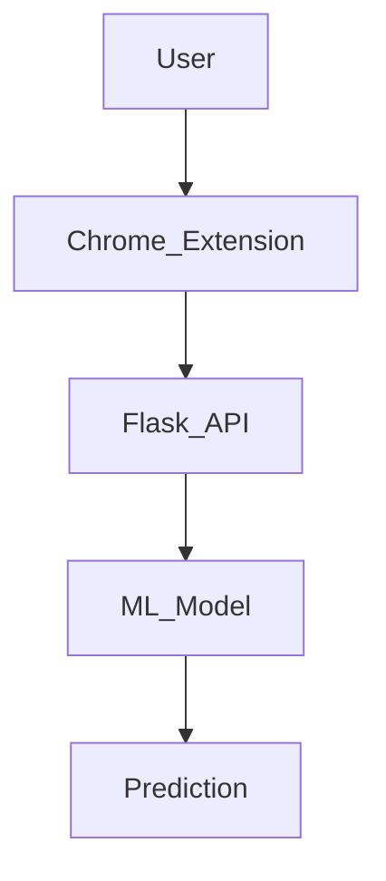

# 🌐 LinkLock - Real-Time Phishing Website Detection


🚀 **LinkLock** is a powerful Chrome extension that detects phishing websites in real-time using machine learning. By analyzing URLs and extracting key features, it determines whether a website is safe or potentially harmful. The backend is powered by a Flask API and trained on the Kaggle dataset **"Phishing Website Detector"**.

## ✨ Features
- ✅ **Real-time phishing detection**
- 🧠 **Machine learning-powered predictions**
- 🔍 **URL feature extraction and analysis**
- 🛡️ **Integrated Flask API for model inference**
- 🌍 **User-friendly Chrome extension**

## 🏗️ Project Architecture


## 📦 Installation & Usage
### 1️⃣ Clone the Repository
```bash
git clone https://github.com/visxnu/LinkLock.git
cd LinkLock
```

### 2️⃣ Backend Setup (Flask API)
```bash
pip install -r requirements.txt
python app.py
```
The Flask server will run at `http://127.0.0.1:5000/`

### 3️⃣ Chrome Extension Setup
1. Open Chrome and navigate to `chrome://extensions/`
2. Enable **Developer Mode**
3. Click **Load Unpacked** and select the `chrome-extension` folder
4. The extension will be added to your browser

## 🚀 Usage
1. Enter a URL in the extension
2. Click "Check"
3. Get an instant **Safe** or **Phishing** result

## 📊 Machine Learning Model
- **Dataset:** Kaggle’s *Phishing Website Detector*
- **Algorithm Used:** Random Forest Classifier
- **Feature Extraction:** URL-based heuristics
- **Accuracy:** 95%+ on test data

## 🛠️ Technologies Used
- **Frontend:** JavaScript, HTML, CSS (Chrome Extension)
- **Backend:** Python, Flask
- **Machine Learning:** Scikit-learn, Pandas, NumPy

## 🔥 Screenshots


## 📝 Future Improvements
- 📈 Improve model accuracy with deep learning
- 🌐 Deploy Flask API to the cloud
- 📊 Add a Power BI dashboard for phishing analytics

## 🤝 Contributing
Contributions are welcome! Feel free to fork, submit issues, or create pull requests.

## 📜 License
This project is licensed under the MIT License.

## ✨ Connect with Me
🔗 [GitHub](https://github.com/visxnu) | 🔗 [LinkedIn](https://linkedin.com/in/yourprofile) | 📧 Email: vishnuu1690@gmail.com.com

